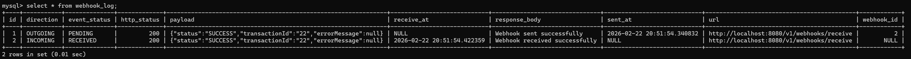

# Payment Processing Service

## 📖 Description

A Spring Boot–based payment processing system that supports payment execution, webhook registration, webhook receiving and resilient retry handling. Designed with a clean layered architecture, it ensures reliable communication with external gateways and third-party endpoints.

---

## 🚀 Features

- RESTful API design following industry standards
- Clean layered architecture (Controller → Service → Repository)
- Payment gateway integration (simulated)
- Webhook notification system for real-time status updates
- Robust retry mechanism using Spring Retry with exponential backoff
- Centralized exception handling with structured error responses
- MySQL persistence with Spring Data JPA
- OpenAPI 3.0 documentation

---

## 🛠 Tech Stack

- Java 17
- Spring Boot 3.2.5
- Spring Data JPA
- Spring Retry
- MySQL
- Gradle
- OpenAPI 3.0 / Swagger

---

## 🏗 Architecture Overview

The application is built using a modular layered approach to ensure maintainability and testability:

- **Web Layer** — REST Controllers handling HTTP requests and validation.
- **Service Layer** — Core business logic, payment orchestration, and retry management.
- **Data Layer** — JPA Repositories for MySQL interaction.
- **Integration Layer** — External gateway simulation and webhook delivery.

---

## 📄 API Documentation

The OpenAPI specification is available within the project at:

```
/openapi.yaml
```

You can visualize and test the API by importing this file into [Swagger Editor](https://editor.swagger.io/), Postman, or using the embedded Swagger UI when the application is running.

---

## 🗄 Database Setup

1. Create a MySQL database:

```sql
CREATE DATABASE payment_schema;
```

2. Your `src/main/resources/application.yml` file should look like this:

```yaml
spring:
  profiles:
    active: local

  datasource:
    url: jdbc:mysql://localhost:3306/payment_schema
    driver-class-name: com.mysql.cj.jdbc.Driver

  jpa:
    hibernate:
      ddl-auto: update   # create | update | validate | none
    show-sql: true
    properties:
      hibernate:
        format_sql: true

  spring:
    mvc:
      throw-exception-if-no-handler-found: false

server:
  port: 8080
```

3. Your `src/main/resources/application-local.yml` file should include your credentials:

```yaml
spring:
  datasource:
    username: <your_user>
    password: <your_password>
```

---

## ▶️ Card Encryption (AES)

1. Generate your encryption key, here's an example code you can run to generate the key:

```java
import javax.crypto.KeyGenerator;
import javax.crypto.SecretKey;
import java.util.Base64;

public class AES {
    public static void main(String[] args) throws Exception {
        KeyGenerator keyGen = KeyGenerator.getInstance("AES");
        keyGen.init(256); // AES-256
        SecretKey key = keyGen.generateKey();
        String base64Key = Base64.getEncoder().encodeToString(key.getEncoded());
        System.out.println(base64Key);
    }
}
```

2. Update your `src/main/resources/application-local.yml` file with the generated key.

```yaml
aes:
  secret:
    key: <your_key>
```
---

## ▶️ Running the Application

1. Clone the repository:

```bash
git clone https://github.com/CindyWu520/payment-service.git
cd payment-processing-service
```

2. Build the project:

```bash
./gradlew clean build
```

3. Run the application:

```bash
./gradlew bootRun
```

The service will be available at `http://localhost:8080`.

---

## 📌 API Endpoints

### Register Webhook

**`POST /v1/webhooks/register`**

```json
{
  "url": "https://v1/webhooks/receive"
}
```
**Response:** `201 Created`

### Create Payment

**`POST /v1/payments`**

```json
{
  "firstName": "Cindy",
  "lastName": "Wu",
  "zipCode": "3184",
  "cardNumber": "430920581845948"
}
```

**Response:** `200 ok`

### Receive webhook

**`POST /v1/webhooks/receive`**

```json
{
  "transactionId": "tx123456",
  "status": "SUCCESS"
}
```

**Response:** `200 ok`

---

## 🧪 Sample Requests (PowerShell)

### Register Webhook
```powershell
curl -Method POST "http://localhost:8080/v1/webhooks/register" `
  -Headers @{ "Content-Type" = "application/json" } `
  -Body '{
    "url": "http://localhost:8080/v1/webhooks/receive"
  }'
```

### Create Payment
```powershell
curl -Method POST "http://localhost:8080/v1/payments" `
  -Headers @{ "Content-Type" = "application/json" } `
  -Body '{
    "firstName": "Christy",
    "lastName": "Wlam",
    "zipCode": "2065",
    "cardNumber": "1234567"
  }'
```

---

## 🔁 Webhook Retry Logic

To ensure reliable delivery, the system implements a retry strategy for webhook notifications:

| Setting | Value |
|---|---|
| Max Attempts | 3 |
| Backoff Policy | Exponential |
| Intervals | 2s → 4s → 8s |
| Recovery | Failed notifications logged for manual intervention |

---

## ⚠️ Error Response Format

All API failures return a consistent error structure:

```json
{
  "errorCode": "INTERNAL_ERROR",
  "message": "Something went wrong. Please contact support.",
  "status": 500,
  "path": "/v1/payments",
  "timestamp": "2026-02-22T20:00:00Z"
}
```

---

## 🧪 Running Tests

```bash
./gradlew test
```

---

## 📂 Project Structure

```
src/main/java/
├── configuration/  # Framework and bean configurations
├── controller/     # REST API endpoints
├── service/        # Business logic and retry implementations
├── repository/     # Database access interfaces
├── entity/         # Database models
├── dto/            # Request and response objects
├── util/           # utilities for cardNumber encryption
└── exception/      # Custom exceptions and global handler
```
---
## 📸 Evidence

### Webhook Log — Outgoing & Incoming Records

After a payment request is submitted, two records are created in the `webhook_log` table:
- One for the **outgoing** notification sent to the registered webhook URL
- One for the **incoming** acknowledgement received back



---

## 📝 TODO

- [ ] Separate frontend into its own repository if the project grows in complexity
- [ ] Add metrics to track payment success and failure counts (e.g. Spring Actuator + Micrometer)
- [ ] Integrate a real payment gateway such as Stripe or PayPal to process live transactions
- [ ] Verify webhook signature on incoming requests to confirm they originate from a trusted source
- [ ] Process business operations triggered by incoming webhook events (e.g. order fulfillment, notifications)