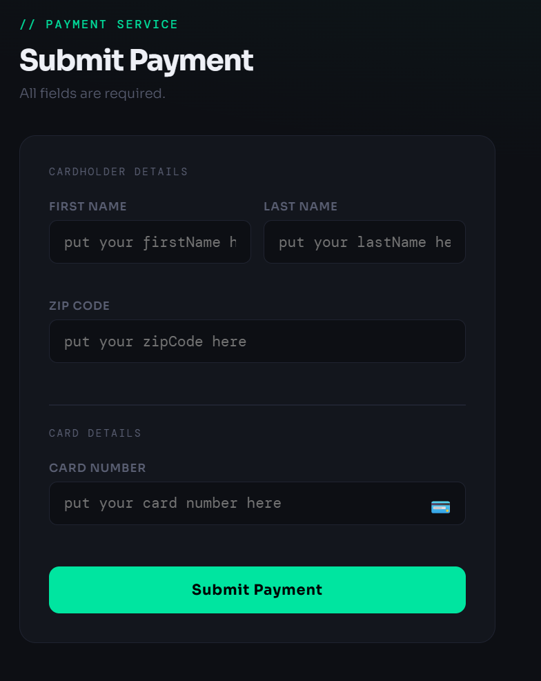
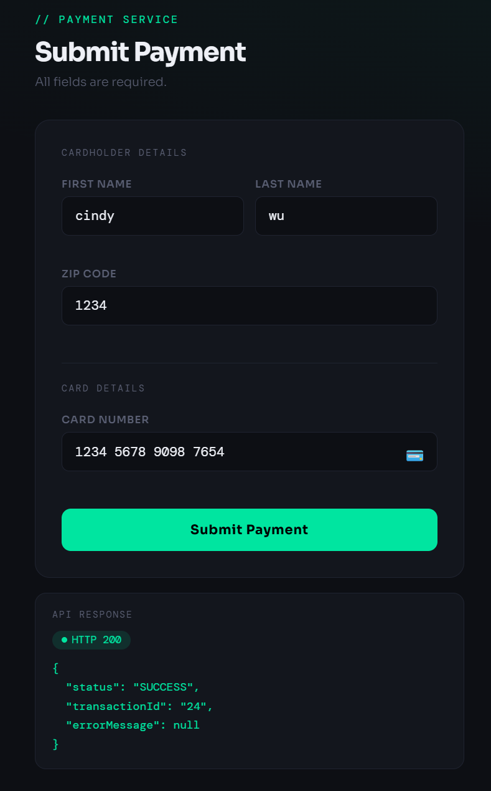
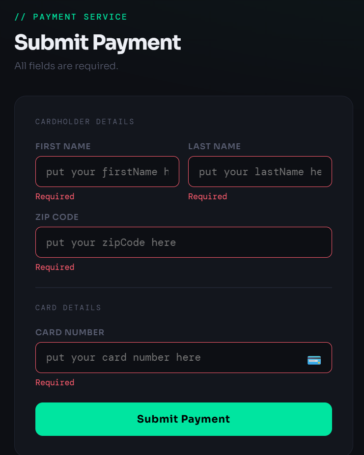
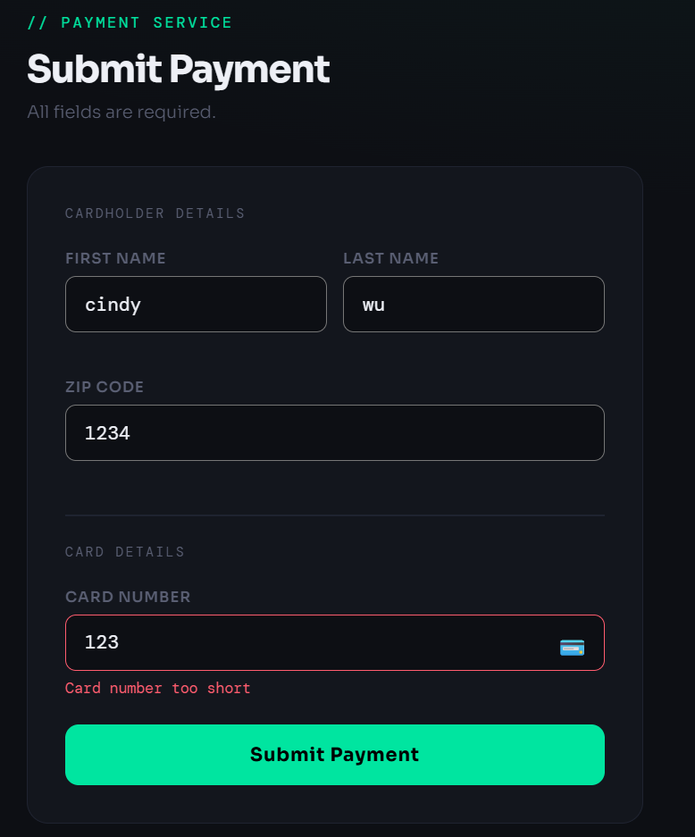
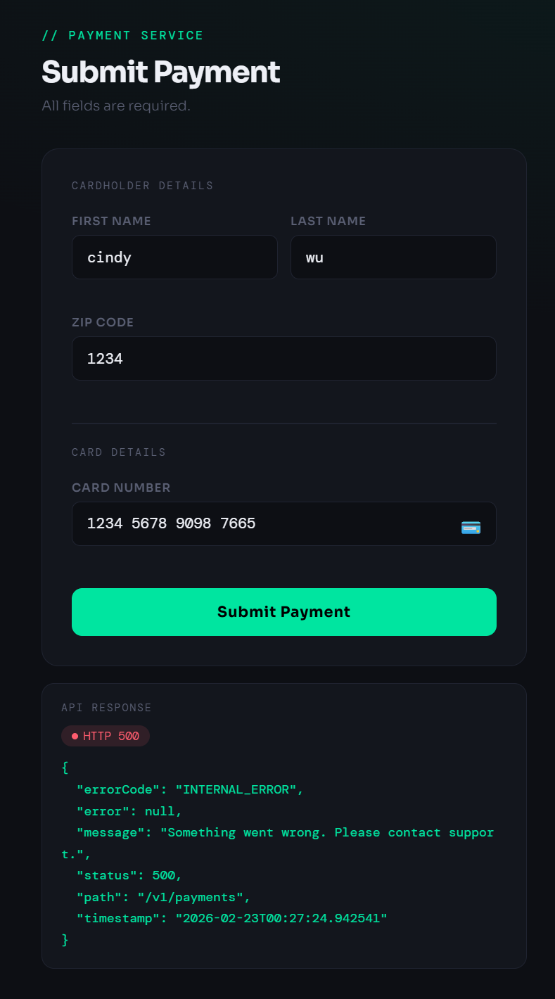

## 🖥 Frontend (React + Vite)

A minimal React frontend for submitting payments locally.

---
### Setup
```bash
cd frontend
npm install
npm run dev
```
Visit `http://localhost:5173`. Requires the Spring Boot backend running on `http://localhost:8080`.

> API calls are proxied via Vite — no CORS configuration needed on the backend.

---

## 📸 Screenshots

### Payment Form
The main payment form where users enter their details.

---

### Successful Payment Response
API response panel showing a successful `200 Created` response after submission.

---

### Validation State
Form validation errors shown when required fields are missing or invalid.


---

### Internal service error
Triggered when a dependent service (e.g. database) is unavailable, the API returns a `500 Internal Server Error`.


